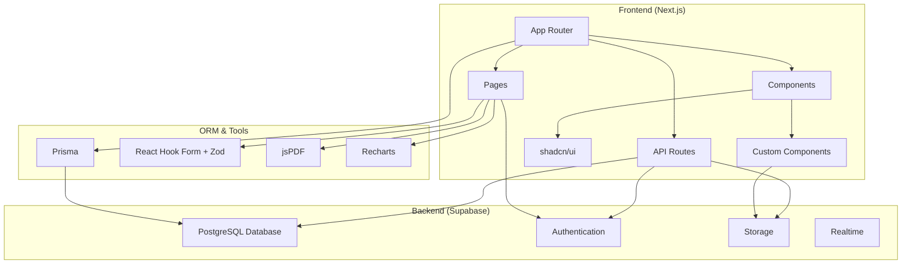
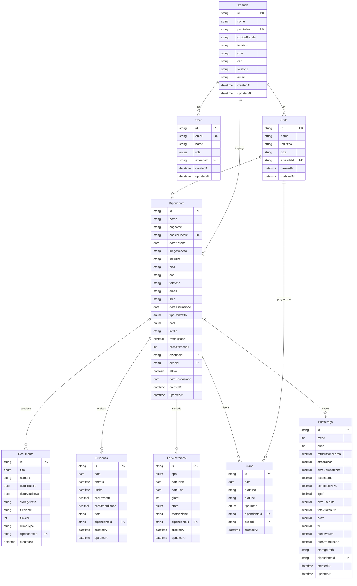
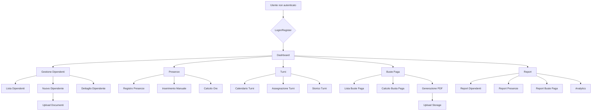
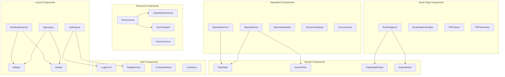
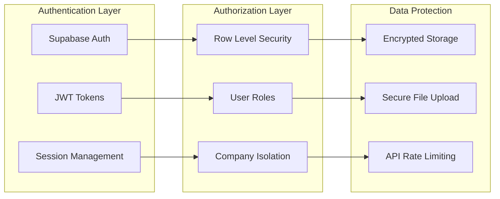
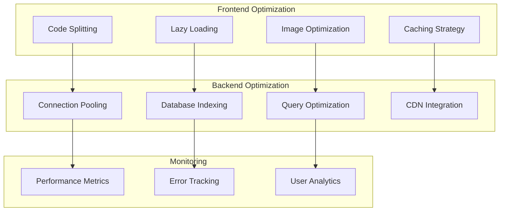
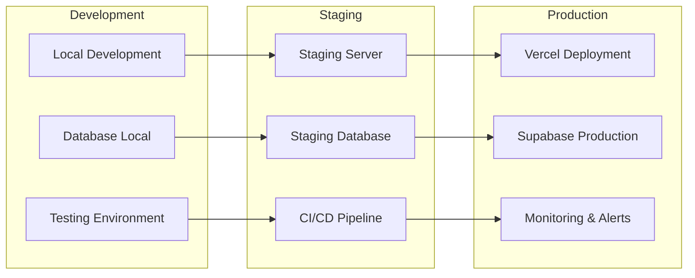

# Architettura PayCrew - Diagramma e Componenti

## Architettura Generale

## Database Schema Architecture

## User Flow Architecture

## Component Architecture

## Security Architecture

## Performance Architecture

## Deployment Architecture

## Technology Stack Details

### Frontend Stack
- **Framework**: Next.js 15 (App Router)
- **Language**: TypeScript
- **Styling**: Tailwind CSS
- **UI Components**: shadcn/ui
- **Forms**: React Hook Form + Zod
- **State Management**: React Context + Zustand
- **Data Fetching**: Native fetch + React Suspense
- **Charts**: Recharts
- **Tables**: TanStack Table
- **PDF Generation**: jsPDF

### Backend Stack
- **Database**: Supabase (PostgreSQL)
- **Authentication**: Supabase Auth
- **File Storage**: Supabase Storage
- **Realtime**: Supabase Realtime
- **ORM**: Prisma
- **API**: Next.js API Routes

### Development Tools
- **Package Manager**: npm
- **Code Quality**: ESLint + Prettier
- **Testing**: Jest + React Testing Library
- **Type Checking**: TypeScript
- **Build Tool**: Turbopack
- **Version Control**: Git

Questa architettura fornisce una base solida e scalabile per PayCrew, con separazione chiara delle responsabilità e best practices per sicurezza e performance.