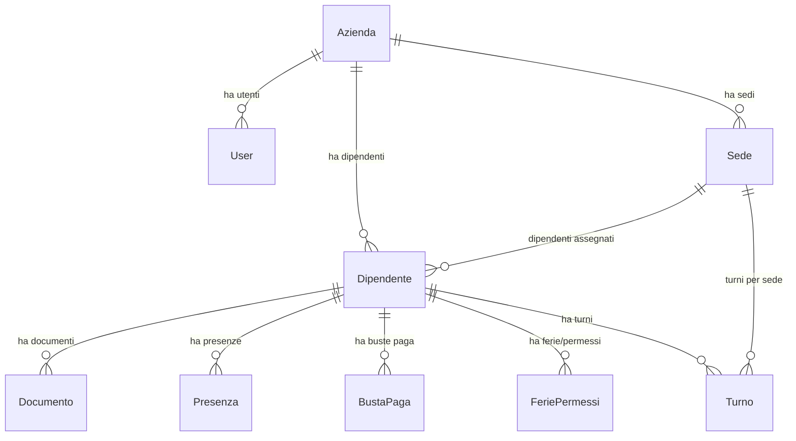

# PayCrew - Piano di Implementazione Completo

## Stato Attuale del Progetto

### ✅ Già Configurato
- Next.js 15 con App Router e TypeScript
- Tailwind CSS per lo styling
- Supabase configurato e funzionante (tramite marketplace)
- Prisma configurato con Supabase PostgreSQL
- Variabili d'ambiente correttamente impostate
- Modello Employee di base in Prisma

### 📋 Da Implementare (basato sulle specifiche)

## Architettura del Progetto

### Stack Tecnologico Completo
```
Frontend: Next.js 15 + React + TypeScript + Tailwind CSS
Backend: Supabase (PostgreSQL + Auth + Storage)
ORM: Prisma
UI: shadcn/ui
Forms: React Hook Form + Zod
PDF: jsPDF
State: React Context + Zustand
Date: date-fns
Charts: Recharts
Tables: TanStack Table
```

### Struttura Database

Il documento specifica un modello database molto più complesso del nostro Employee base:



## Piano di Implementazione per Sprint

### Sprint 1 - Fondamenta (Settimana 1)
1. **Aggiornamento Schema Prisma**
   - Sostituire il modello Employee base con lo schema completo
   - Creare tutte le relazioni tra tabelle
   - Generare e applicare le migrazioni

2. **Configurazione Supabase Avanzata**
   - Setup client, server e middleware Supabase
   - Configurazione Autenticazione
   - Creazione Storage Buckets
   - Implementazione RLS policies

3. **UI Components Base**
   - Setup shadcn/ui
   - Layout base con sidebar
   - Sistema di routing protetto

### Sprint 2 - Gestione Dipendenti (Settimana 2)
1. **CRUD Dipendenti Completo**
   - Form di inserimento/modifica con validazione
   - Tabella dipendenti con ricerca e filtro
   - Gestione documenti con upload

2. **Autenticazione Utenti**
   - Login/register pages
   - Protected routes
   - Gestione ruoli (SUPER_ADMIN, ADMIN, MANAGER, USER)

3. **Gestione Aziende/Sedi**
   - CRUD per aziende e sedi
   - Assegnazione dipendenti alle sedi

### Sprint 3 - Gestione Presenze e Turni (Settimana 3)
1. **Sistema Presenze**
   - Registro presenze giornaliero
   - Calcolo ore lavorate
   - Gestione straordinari

2. **Gestione Turni**
   - Creazione turni settimanali
   - Assegnazione turni ai dipendenti
   - Calendario turni

3. **Dashboard KPI**
   - Metriche principali
   - Grafici con Recharts
   - Statistiche in tempo reale

### Sprint 4 - Buste Paga e Documenti (Settimana 4)
1. **Calcolo Buste Paga**
   - Logica di calcolo complessa
   - Gestione competenze e trattenute
   - Calcolo INPS e IRPEF

2. **Generazione PDF**
   - Cedolini PDF con jsPDF
   - Upload su Supabase Storage
   - Download e visualizzazione

3. **Gestione Documenti**
   - Upload documenti dipendenti
   - Scadenze documenti
   - Notifiche scadenze

## Dettagli Tecnici Chiave

### 1. Schema Prisma Completo
Il documento specifica 11 modelli principali:
- User (con ruoli)
- Azienda
- Sede
- Dipendente (con dati contrattuali)
- Documento (con scadenze)
- Presenza (con ore lavorate)
- Turno (con tipologie)
- FeriePermessi (con workflow approvazione)
- BustaPaga (con calcoli completi)
- Enum per vari tipi (contratti, CCNL, documenti, etc.)

### 2. Autenticazione Multi-livello
- Supabase Auth per l'autenticazione base
- RLS policies per sicurezza dati
- Ruoli utente per permessi granulari
- Multi-azienda support

### 3. Storage Documenti
- Supabase Storage per documenti dipendenti
- Bucket separati per documenti e cedolini
- Policies RLS per accesso sicuro
- Gestione scadenze automatica

### 4. Calcoli Complessi
- Retribuzioni lordo/netto
- Calcoli INPS e IRPEF
- Gestione straordinari
- TFR accumulato

## Prossimi Passi Immediati

1. **Installare le dipendenze mancanti**:
   ```bash
   npm install @supabase/ssr
   npx shadcn-ui@latest init
   npm install react-hook-form @hookform/resolvers zod
   npm install date-fns recharts @tanstack/react-table
   npm install jspdf jspdf-autotable zustand
   ```

2. **Configurare i client Supabase**:
   - lib/supabase/client.ts
   - lib/supabase/server.ts
   - lib/supabase/middleware.ts
   - middleware.ts

3. **Aggiornare lo schema Prisma** con il modello completo

4. **Creare la struttura delle cartelle** come specificato nel documento

5. **Implementare l'autenticazione** base

## Considerazioni Architetturali

### Performance
- Connection pooler per Prisma (già configurato)
- Lazy loading per dati pesanti
- Pagination per tabelle grandi
- Caching dove appropriato

### Sicurezza
- RLS policies su tutte le tabelle
- Validazione input lato client e server
- File upload sicuri
- Autenticazione multi-livello

### Scalabilità
- Architettura multi-azienda
- Separazione chiara tra logica business
- Componenti riutilizzabili
- API REST ben strutturate

Questo piano sfrutta la solida base che abbiamo già costruito con Supabase e Prisma, estendendola per creare un gestionale completo e professionale.